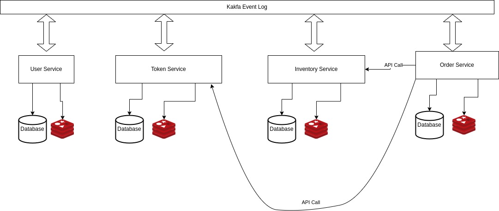

# bookstore

## Architecture Overview

```
Microservices
│
├── UserService/
│
├── TokenService/
│
├── InventoryService/
│
└── OrderService/
```

- **UserService**: Manages the user registration and login. It's responsible for user authentication and authorization.

- **TokenService**: Manages the user's balance and the user's purchase token. It's responsible for the user's balance and the user's purchase token.

- **InventoryService**: Manages the books and the inventory. It's responsible for the books and the inventory.

- **OrderService**: Manages the orders and the order processing. It's responsible for the orders and the order processing.

## Communication



## Technologies

- **.NET 8.0**: The services are built with .NET 8.0.

- **Docker**: The services are containerized with Docker.

- **Docker Compose**: The services are orchestrated with Docker Compose.

- **PostgreSQL**: The database is PostgreSQL.

- **Redis**: The cache is Redis.

- **Kafka**: The message broker is Kafka.

- **Swagger**: The services are documented with Swagger.

- **xUnit**: The tests are written with xUnit.


## Requirements

- [Docker](https://www.docker.com/)

- [Docker Compose](https://docs.docker.com/compose/)

- [.NET 8.0 SDK or later](https://dotnet.microsoft.com/en-us/download/dotnet/8.0)

- The projects are build in a debian linux distro, so it's better to run them in a linux environment.

## Running the tests

### 1. Clone the repository

```bash
git clone https://github.com/mojbaba/bookstore.git
```

### 2. Change into the directory

```bash
cd bookstore
```

There are integration tests which test the services in isolation but with the real database, redis and kafka. They test each service use case and the flow of the services.

- Integration tests use TestContainers to run the real database, redis and kafka in the docker containers. So you need to have docker and docker-compose installed.

*there should be lots of unit tests for each service, but I didn't have enough time to implement them.*

```bash
dotnet test
```


## Running the application

### 1. Clone the repository

```bash
git clone https://github.com/mojbaba/bookstore.git
```

### 2. Change into the directory

```bash
cd bookstore
```

### 3. Run the infrastructure


```bash
docker compose --file docker-compose.infra.yml up -d
```
if you get network error, you can create a network with the following command:
```bash
docker network create bookstore
```


### 4. Run the migrations

```bash
docker compose --file docker-compose.migrations.yml up -d
```

### 5. Run the application

```bash
docker compose --file docker-compose.apis.yml up -d
```

### 6. Open your browser 
    
- User Service : [http://localhost:8081](http://localhost:8081/swagger/index.html)

- Inventory Service: [http://localhost:808](http://localhost:8080/swagger/index.html)

- Token Service: [http://localhost:808](http://localhost:8082/swagger/index.html)

- Order Service: [http://localhost:808](http://localhost:8083/swagger/index.html)

*it was better to have a single entry point for all services, but I didn't have enough time to implement it. (Nginx, Ocelot, etc.)*

### 7. Register a user

on Swagger UI (UserService -> register) 

```json
{
  "email": "user@example.com",
  "password": "string"
}
```

### 8. Login and get a token

on Swagger UI (UserService -> login) 

```json
{
  "email": "user@example.com",
  "password": "string"
}
```

and get a token

```json
{
  "email": "user@example.com",
  "token": "{JWT_TOKEN}"
}
```

### 9. Create a book

on Swagger UI (InventoryService -> create)

```json
{
  "title": "Book store micoservice architecure",
  "author": "Mojbaba",
  "price": 20,
  "amount": 1
}
```

get the book id

```json
{
  "bookId": "{GUID}"
}
```

### 10. Authorize to the Token Service

on Swagger UI use `Authorize` button and add the token `{JWT_TOKEN}` got from step 8.

### 11. Add Book Purchase Token

on Swagger UI (TokenService -> add)

```json
{
  "amount": 1500
}
```

### 12. Authorize to the Order Service

on Swagger UI use `Authorize` button and add the token `{JWT_TOKEN}` got from step 8.

### 13. Create an order

on Swagger UI (OrderService -> create)

```json
{
  "bookIds": [
    "{the book id got from step 9}"
  ]
}
```

### 14. Get the order

on Swagger UI (OrderService -> Admin Orders)

you can track the order statuses.

`"isPaymentProcessed": true` and `"isInventoryProcessed": true` means the order is processed successfully.

`"isPaymentProcessed": true` means the TokenService got the OrderCreatedKafkaEvent and deducted the amount from the user's account


```json
[
  {
    "id": "string",
    "userId": "string",
    "status": 0,
    "createdAt": "2024-02-24T03:44:56.287Z",
    "isPaymentProcessed": true,
    "isInventoryProcessed": true,
    "failReason": "string"
  }
]
```

### 15. Track the user balance

on Swagger UI (TokenService -> balance) (must authorize with the token got from step 8)

```json
{
  "userId": "{GUID}",
  "balance": {NEW_BALANCE}
}
```

the user's balance is deducted by 1500 after the order is processed.

*the inventory service is not completely implemented, so the inventory is not deducted after the order is processed. it just accepts the order anyway and published success packed books event*

## Notes

- The authorization are implemented with JWT. so when user log out, the token is blacklisted and the user can't use it anymore. the other services get notified by the the Kafka event.

- The blacklisted tokens are stored in the Redis cache with some expiration time.

- The services are not completely implemented, so there are some missing parts and bugs.

- Services are totally stateless and can be scaled horizontally.

- API Gateway, Circuit Breaker, Rate Limiting, etc. are not implemented.

- Notifications, Logging, Monitoring, etc. are not implemented.

- It can be implemented with gRPC instead of REST inter-comunications.

- The services are not Completly DDD, CQRS, Event Sourcing, but they are designed to be implemented with these patterns.

- The event log consumers are the default kafka consumers, which means they are garantee at least once delivery. but each service stores the events in the database and checks the event id to prevent duplicate processing.